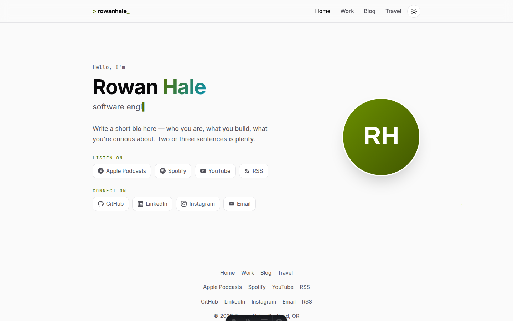

# Astro Podcaster

A personal site theme for [Astro](https://astro.build) — portfolio, blog, travel photo galleries, and a podcast episode player, in one quiet, fast template.

This is a fork of [Astro Wanderer](https://github.com/igagansingh/astro-wanderer) by [Gagan Singh](https://igagansingh.com), extended with podcast platform links and a themed audio player for episode posts. See [Credits](#credits) for the full story.

**[Live demo](https://igagansingh.com/astro-wanderer)** *(the original Astro Wanderer theme — it doesn't include this fork's podcast features)*



## Why Astro Podcaster

Most developer portfolios stop at the work page. This theme is built around the idea that a good personal site shows what you're like *when you're not working* — so it ships with a travel section where every trip is a story with a photo carousel and lightbox, right next to your résumé and blog. On top of that, it now doubles as a home for a podcast: platform links up front, and a themed player on any post that has an episode to go with it.

## Features

- **Home** — hero with a typing animation, avatar, podcast platform links, and social links
- **Podcast** — "Listen on" links to your platforms, a themed audio player (full on post pages, compact on cards), and podcast links in the footer
- **Work** — expandable experience timeline, education, and skill groups, all from one data file
- **Blog** — markdown posts with tags, tag pages, prev/next navigation, reading time, drafts, and optional episode audio
- **Travel** — trip entries with hero images, highlight badges, photo carousel, lightbox with keyboard navigation, and optional video support
- **Zero JS by default** — only a handful of tiny scripts (theme toggle, typing effect, gallery, audio player); no framework runtime
- **Dark/light mode** — respects `prefers-color-scheme`, remembers your choice, no flash on load
- **SEO ready** — canonical URLs, Open Graph/Twitter cards, JSON-LD structured data, sitemap, RSS feed
- **Accessible** — semantic HTML, skip-free keyboard navigation in galleries, `aria` labels throughout, reduced-motion support on the player
- **One config file** — name, socials, podcast links, bio, and résumé all live in plain TypeScript data files
- **100/100 Lighthouse** out of the box on a static build

## Quick start

Use this template with the Astro CLI:

```sh
npm create astro@latest -- --template igagansingh/astro-wanderer
```

Or clone it directly:

```sh
git clone https://github.com/igagansingh/astro-wanderer.git
cd astro-wanderer
npm install
npm run dev
```

Both of those pull the original Astro Wanderer theme (no podcast features). To start from this fork instead, clone or use this repository directly.

Then open `src/data/site.ts` — it's the single source of truth for your name, tagline, social links, podcast links, and production URL. The sample post in `src/content/blog/getting-started.md` walks through everything else, including podcast setup.

## Project structure

```
├── public/
│   ├── audio/            # episode audio files (mp3, etc.)
│   └── img/              # avatar, og image, trip photos
├── src/
│   ├── components/
│   │   ├── AudioPlayer.astro  # full (post) + compact (card) episode player
│   │   ├── LinkRow.astro      # "Listen on" / "Connect on" pill rows
│   │   ├── Icon.astro         # inline-SVG icon set
│   │   └── …                 # Header, Hero, Footer, Gallery, PostCard, …
│   ├── content/
│   │   ├── blog/         # markdown posts (optional `audio` frontmatter)
│   │   └── trips/        # markdown trip stories
│   ├── content.config.ts # blog + trips schemas
│   ├── data/
│   │   ├── site.ts       # ← edit this first (identity, socials, podcast)
│   │   ├── icons.ts      # shared icon-name type used by Icon.astro + site.ts
│   │   └── resume.ts     # experience, education, skills, typing roles
│   ├── pages/            # index, work, blog, travel, 404, rss
│   └── styles/global.css # design tokens + all styling (no framework)
└── astro.config.mjs      # set your production URL here
```

## Writing content

### Blog post

Create a markdown file in `src/content/blog/`:

```md
---
title: My first post
subtitle: An optional subtitle
date: 2026-01-15
tags: [notes]
category: tech        # or life
description: One-liner for cards and SEO.
draft: false          # true hides the post from builds
---

Your words here.
```

### Podcast episode

Add an `audio` block to any post's frontmatter to attach a themed player to it:

```md
---
title: Episode 1 — Getting started
date: 2026-01-15
audio:
  src: /audio/episode-01.mp3   # a public/ path, or a link to your podcast host's CDN
  duration: 1820                # seconds — optional, shown before the browser loads the file
  episode: 1                    # optional, not currently rendered — yours to use
  title: Episode 1 — full title # optional, defaults to the post's own title
---

Show notes here.
```

| Field      | Required | Notes                                                                 |
| :--------- | :------: | :--------------------------------------------------------------------- |
| `src`      |    ✅    | MP3 (or any browser-playable audio) URL — `/public` path or host CDN  |
| `duration` |          | Seconds. Shown as the total time before metadata loads.               |
| `episode`  |          | Number. Not rendered by the theme; free for your own use.             |
| `title`    |          | Overrides the player's title; defaults to the post's `title`.         |

That's the whole schema — see `src/content.config.ts`. Add the block and the player shows up automatically:

- **Compact** player (play/pause + elapsed/duration) on `/blog` index cards, via `PostCard.astro`.
- **Full** player (scrubber, ±15s/+30s skip, 1×–2× speed, download) on the post's own page, via `src/pages/blog/[...slug].astro`.

Both use the same `AudioPlayer.astro` component (`src`, `title`, `duration`, `variant: 'full' | 'compact'`). Multiple players can sit on one page — starting one automatically pauses any other that's playing.

### Trip entry

Create a markdown file in `src/content/trips/`, drop photos into `public/img/trips/<trip>/`, and list them:

```md
---
title: Kyoto, 2026
place: Kyoto, Japan
date: 2026-04-10
summary: One line for the card.
heroImage: /img/trips/kyoto/hero.jpg
circlePhotos:                 # photos for the rotating ring
  - /img/trips/kyoto/torii.jpg
gallery:
  - /img/trips/kyoto/hero.jpg
highlights:
  - Fushimi Inari at sunrise
---

Story body here.
```

Photos in `gallery` get a carousel with a click-to-open lightbox, thumbnail strip, fullscreen mode, and arrow-key navigation. `.mp4`/`.webm` files are supported alongside images.

## Podcast configuration reference

Everything below lives in `src/data/site.ts` unless noted, and needs no code changes to use.

### `site.podcast` — platform links ("Listen on")

```ts
podcast: {
  name: 'Your Show Name',       // not yet rendered anywhere — reserved for your own use
  links: {
    apple:   { url: 'https://podcasts.apple.com/…', label: 'Apple Podcasts', icon: 'apple-podcasts' },
    spotify: { url: 'https://open.spotify.com/…',   label: 'Spotify',        icon: 'spotify' },
    youtube: { url: 'https://youtube.com/…',        label: 'YouTube',        icon: 'youtube' },
    feed:    { url: 'https://feeds.example.com/…',  label: 'RSS',            icon: 'rss' },
  },
},
```

- Add, remove, or reorder entries freely — each key just needs a `url` and `label`, with an optional `icon`.
- `links.feed` is your **podcast host's** RSS feed (Apple/Spotify/etc. index from this). It's separate from the site's own `/rss.xml`, which lives in `site.socials.rss` below.
- Renders in two places, both picking up changes automatically:
  - **Hero** (`src/components/Hero.astro`) — the "Listen on" row, above "Connect on".
  - **Footer** (`src/components/Footer.astro`) — its own row, alongside nav and social links.
- Also folded into the homepage's JSON-LD `sameAs` (`src/pages/index.astro`) for SEO.

### `site.socials` — personal links ("Connect on")

```ts
socials: {
  github:    { url: 'https://github.com', label: 'GitHub', icon: 'github' },
  linkedin:  { url: '…', label: 'LinkedIn', icon: 'linkedin' },
  instagram: { url: '…', label: 'Instagram', icon: 'instagram' },
  email:     { url: 'mailto:…', label: 'Email', icon: 'email' },
  rss:       { url: '/rss.xml', label: 'RSS', icon: 'rss' },
},
```

- The hero's "Connect on" row shows all of these **except `rss`** — it's omitted there on purpose, since it would sit directly under the podcast feed's own RSS pill and just repeat it. `rss` still appears in the footer's socials row.
- Delete or add entries the same way as `podcast.links`.

### Episode audio (blog frontmatter)

See [Podcast episode](#podcast-episode) above and `src/content.config.ts` for the full `audio` schema (`src`, `duration`, `episode`, `title`).

### `AudioPlayer.astro` props

| Prop       | Type                      | Default   | Notes                                      |
| :--------- | :------------------------ | :-------- | :------------------------------------------ |
| `src`      | `string`                  | —         | Required. The audio URL.                    |
| `title`    | `string`                  | —         | Required. Shown on the full variant; used for `aria-label`s on both. |
| `duration` | `number`                  | —         | Seconds, optional.                          |
| `variant`  | `'full' \| 'compact'`     | `'full'`  | `full` adds skip, speed, and download.      |
| `class`    | `string`                  | —         | Extra class on the root element.            |

### Icons

Podcast/audio-related names added to `src/components/Icon.astro` (the icon set, plus the `IconName` type in `src/data/icons.ts` that both `Icon.astro` and `site.ts` import): `apple-podcasts`, `spotify`, `youtube`, `podcast`, `play`, `pause`, `skip-back`, `skip-forward`. Use any of them as `icon` on a `site.podcast.links` or `site.socials` entry, or directly via `<Icon name="…" />`.

### `LinkRow.astro` props

The shared component behind both the "Listen on" and "Connect on" rows — pass it a different `links` object to reuse it elsewhere.

| Prop        | Type                        | Notes                                               |
| :---------- | :--------------------------- | :--------------------------------------------------- |
| `heading`   | `string`                    | Required. The eyebrow label above the row.          |
| `links`     | `Record<string, SocialLink>` | Required. Same shape as `site.socials`/`site.podcast.links`. |
| `linkClass` | `string`                    | Optional extra class per pill — `podcast-link` gets the secondary-accent hover tint. |
| `class`     | `string`                    | Optional class on the wrapping `<div>`.             |

## Customization checklist

1. `src/data/site.ts` — name, description, URL, socials, and podcast platform links
2. `src/data/resume.ts` — roles, education, skills, hero typing words
3. `public/img/avatar.svg` → your photo · `public/img/og.jpg` → a 1200×630 share card
4. `astro.config.mjs` — set `site` to your production URL, and set (or remove) `base`
5. Add your first episode's `audio` block, or delete the sample one in `getting-started.md`
6. Write real content, then delete the two sample posts and sample trip

## Deploy

The included `.github/workflows/deploy.yml` builds and deploys to GitHub Pages on every push to `main`. In your repo settings, set **Settings → Pages → Source** to **GitHub Actions**.

### Hosting at a subpath (e.g. `username.github.io/my-repo`)

Keep `base: '/my-repo'` in `astro.config.mjs` — it must match your repo's name for the project-site URL to resolve. All internal links and assets are routed through a single `withBase()` helper, so everything just works. The deploy workflow automatically nests the build output under your base path so GitHub Pages resolves it. This is how the [live demo](https://igagansingh.com/astro-wanderer) is hosted.

### Hosting at the domain root (`example.com`)

Remove the `base` line from `astro.config.mjs`. The workflow detects this and ships the output un-nested.

Any static host works too — Netlify, Vercel, Cloudflare Pages — just point the build command at `npm run build` with output `dist/`.

## Commands

| Command           | Action                                    |
| :---------------- | :---------------------------------------- |
| `npm run dev`     | Start local dev server                    |
| `npm run build`   | Production build to `./dist/`             |
| `npm run preview` | Preview the production build locally      |
| `npm run check`   | Type-check the project                    |

## Credits

Originally created as **Astro Wanderer** by [Gagan Singh](https://igagansingh.com) with [opencode](https://opencode.ai) — every part of the original template, from the design tokens to the photo lightbox, was written pair-programming style with an AI coding agent. All credit for the theme's foundation — the design system, the travel section, the blog, the résumé page — goes to that original project.

This fork, **Astro Podcaster**, builds on that foundation with podcast platform links, a themed episode audio player, and a lime-green rebrand, added the same way: pair-programming style with an AI coding agent.

## License

MIT — free for personal and commercial use. If it saved you an afternoon, a star or a link back (to the [original theme](https://github.com/igagansingh/astro-wanderer) this is built on) is always appreciated.
